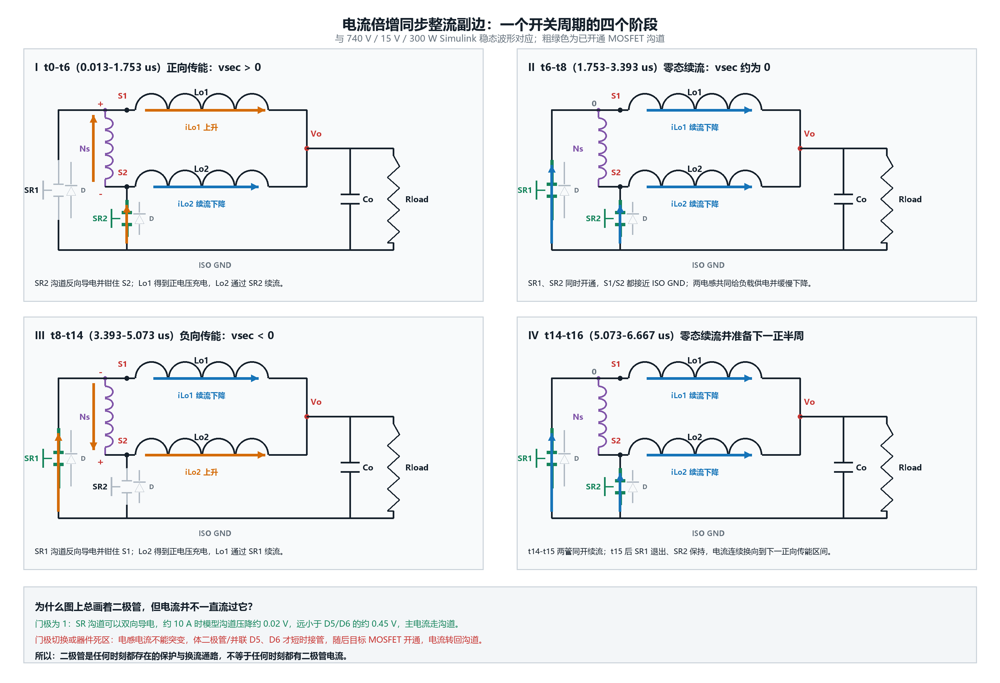
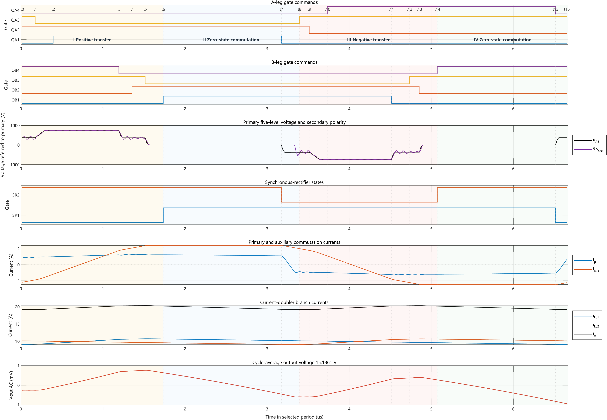
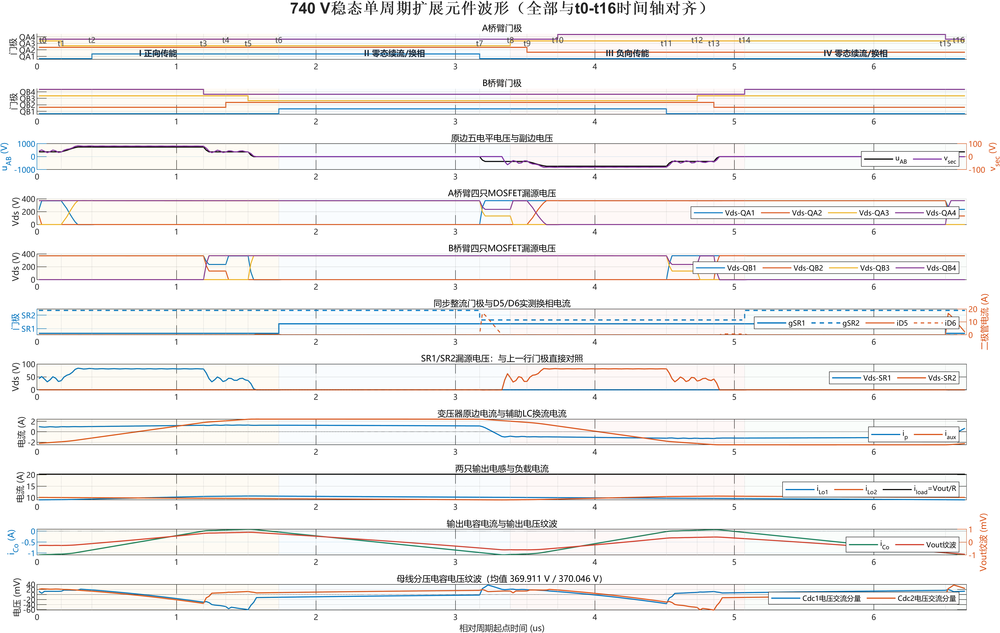

# NPC Three-Level PSFB Operating Cycle

## Secondary connection and four operating stages

The transformer secondary is a single winding with terminals S1 and S2, not a center-tapped winding. The current-doubler paths are:

```text
S1 -> Lo1 -> Vo
S2 -> Lo2 -> Vo
S1 -> SR1 / D5 -> ISO GND
S2 -> SR2 / D6 -> ISO GND
Vo -> Co -> Rload -> ISO GND
```

SR1 and SR2 are synchronous-rectifier MOSFETs. With their gates on, the low-resistance MOSFET channels carry the steady current. D5/D6 and the MOSFET body diodes provide continuity during dead time and commutation; they are not the continuous steady-state rectifiers.



At 740 V, the switching period is 6.667 us. The aligned t0-t16 event sequence separates into four physical stages.

### I. t0-t6: positive energy transfer, 0.013-1.733 us

`uAB` progresses through approximately `+Ui/2 -> +Ui -> +Ui/2`, so `vsec > 0` and S1 is above S2. SR2 holds S2 near ISO GND while SR1 is off. The active energy path is `S1 -> Lo1 -> Vo/load -> ISO GND -> SR2 -> S2 -> secondary winding -> S1`. `Lo1` charges from about 9.051 A to 10.659 A; `Lo2` freewheels and falls from about 10.107 A to 9.547 A.

### II. t6-t8: zero-state freewheeling and polarity commutation, 1.733-3.393 us

Both legs enter the same state so `uAB` and `vsec` are close to zero. SR1 and SR2 conduct together and each output inductor supplies the load through its own freewheeling loop. Near t7, `Lr`, the auxiliary LC branch, and device Coss change bridge-leg voltage while primary current transitions from positive to negative. The required outer switch is then enabled at low Vds.

### III. t8-t14: negative energy transfer, 3.393-5.073 us

The primary waveform mirrors the first transfer interval: `uAB` is approximately `-Ui/2 -> -Ui -> -Ui/2`, `vsec < 0`, and S2 is above S1. SR1 holds S1 near ISO GND. Energy follows `S2 -> Lo2 -> Vo/load -> ISO GND -> SR1 -> S1 -> secondary winding -> S2`. `Lo2` rises from about 9.062 A to 10.616 A while `Lo1` freewheels from about 10.119 A to 9.572 A.

### IV. t14-t16: zero-state freewheeling and next positive transition, 5.073-6.667 us

The legs share the negative state and the secondary voltage returns close to zero. Both inductors continue to support the load and decay slightly. At t15 the A leg enters O/dead time; SR1 releases and SR2 remains prepared for the next positive transfer. Current continuity may briefly use D5/D6 or body-diode paths before the commanded channel takes over.

## Aligned t0-t16 state table

Gate order is `QA1 QA2 QA3 QA4 | QB1 QB2 QB3 QB4 | SR1 SR2`; P/O/N identify the two NPC leg outputs.

| Interval | A/B state | Gate state | Main uAB level | Secondary result |
|---|---|---|---:|---|
| t0-t1 | O/N | `0110 | 0011 | 01` | +Ui/2 | SR2 on, Lo1 charges |
| t1-t2 | O dead-time/N | `0100 | 0011 | 01` | +Ui/2 | A outer transition |
| t2-t3 | P/N | `1100 | 0011 | 01` | +Ui | Maximum positive transfer |
| t3-t4 | P/O dead-time | `1100 | 0010 | 01` | +Ui | B outer transition |
| t4-t5 | P/O | `1100 | 0110 | 01` | +Ui/2 | Reduced positive transfer |
| t5-t6 | P/O dead-time | `1100 | 0100 | 01` | +Ui/2 | Entry to zero state |
| t6-t7 | P/P | `1100 | 1100 | 11` | 0 | Dual-inductor freewheel |
| t7-t8 | O dead-time/P | `0100 | 1100 | 10` | 0 to -Ui/2 | Polarity commutation |
| t8-t9 | O/P | `0110 | 1100 | 10` | -Ui/2 | SR1 on, Lo2 charges |
| t9-t10 | O dead-time/P | `0010 | 1100 | 10` | -Ui/2 | A outer transition |
| t10-t11 | N/P | `0011 | 1100 | 10` | -Ui | Maximum negative transfer |
| t11-t12 | N/O dead-time | `0011 | 0100 | 10` | -Ui | B outer transition |
| t12-t13 | N/O | `0011 | 0110 | 10` | -Ui/2 | Reduced negative transfer |
| t13-t14 | N/O dead-time | `0011 | 0010 | 10` | -Ui/2 | Entry to zero state |
| t14-t15 | N/N | `0011 | 0011 | 11` | 0 | Dual-inductor freewheel |
| t15-t16 | O dead-time/N | `0010 | 0011 | 01` | 0 to +Ui/2 | Prepare next positive transfer |



## Rectifier commutation detail

At 740 V, D6 conducts noticeably only near the t7 commutation pulse and D5 only near t15. The measured pulse duration above 0.1 A is approximately 0.32 us for each diode. In the long freewheeling intervals, commanded SR channels provide the low-loss current return. The alternating Lo1/Lo2 ramps partially cancel at the output, which is why `iLo1 + iLo2` has lower ripple than either inductor current.



## Interpretation boundary

The t0-t16 table is an aligned explanation of one 740 V steady-state cycle. The exact transition instants and resonant slopes vary with input voltage, load, dead time, Coss, leakage inductance, and the auxiliary branch. The control objective remains output regulation across the documented input range; it does not imply unchanged soft-switching classification outside the 740 V baseline.
