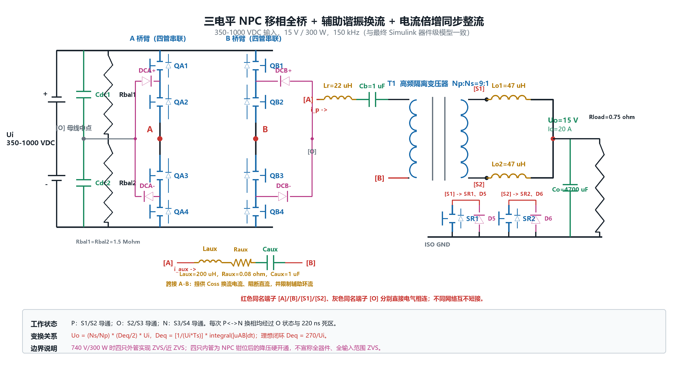
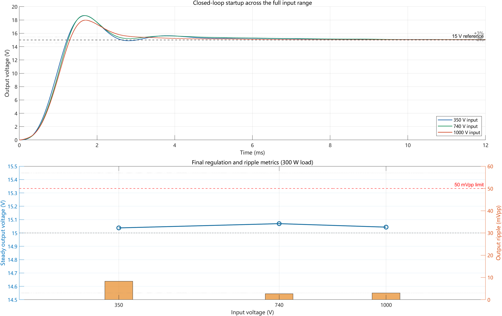
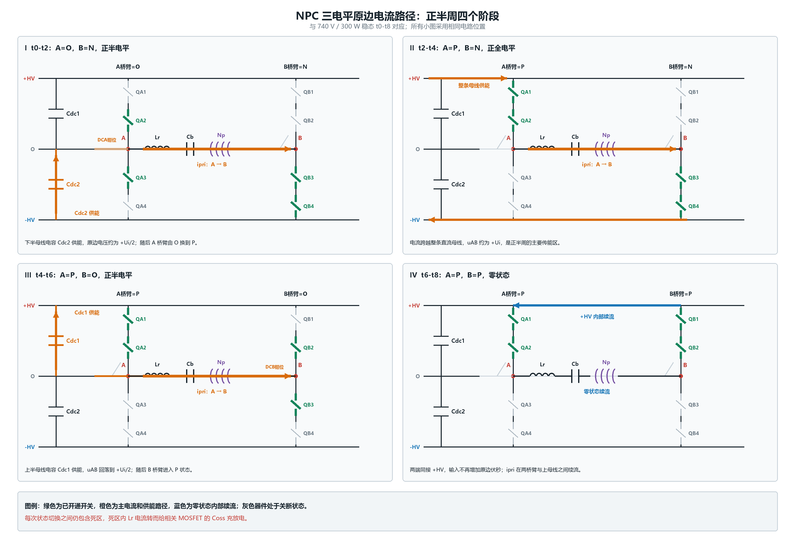
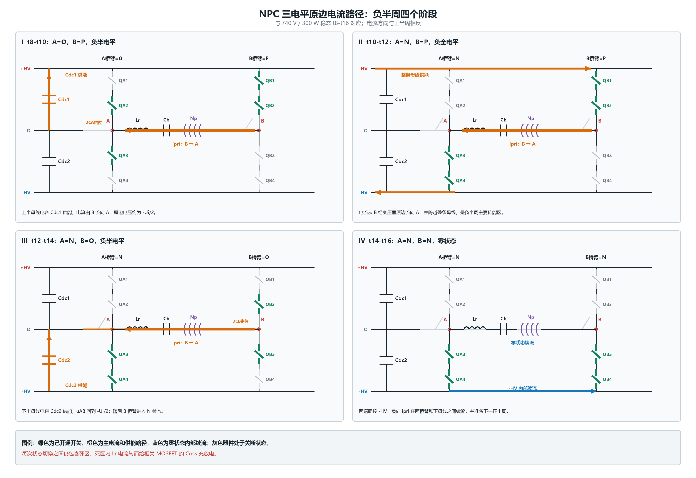
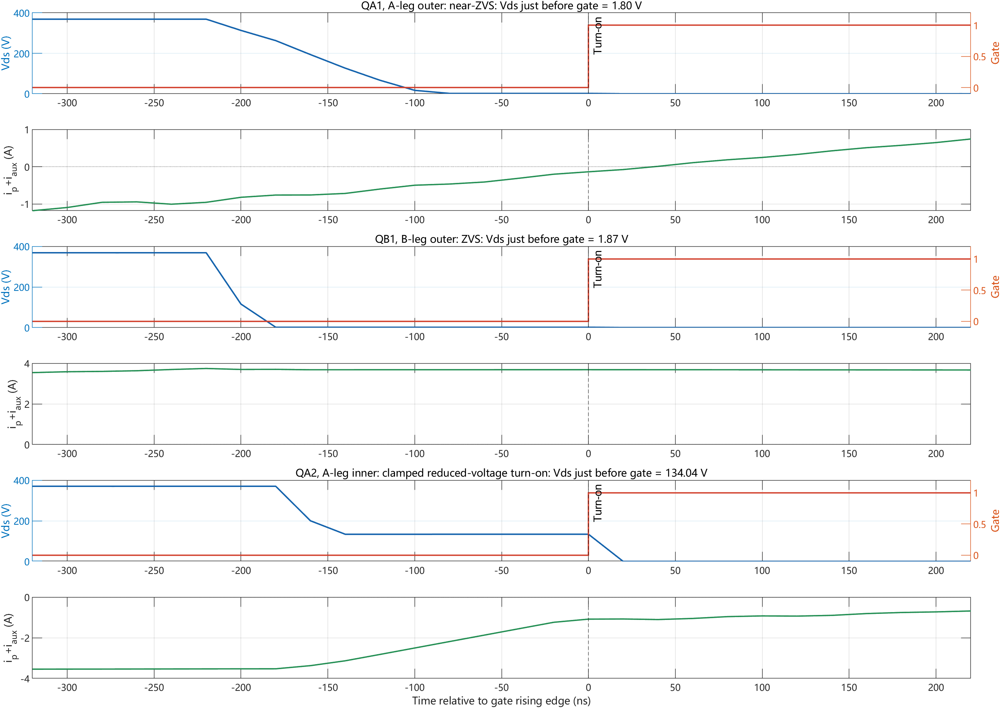

# NPC Three-Level PSFB Topology and Waveforms

## Design scope

The simulated converter accepts 350-1000 VDC and regulates a 15 V, 300 W output at a 150 kHz switching frequency. The power stage combines a diode-clamped NPC three-level phase-shift full bridge, an isolated auxiliary LC commutation branch, a 9:1 high-frequency transformer, and a single-secondary current-doubler synchronous rectifier. A measured-output PI loop with input-voltage feed-forward varies phase shift across the input range.

This is a combined engineering optimization built from established NPC, phase-shift, current-doubler, and resonant-commutation techniques; it is not presented as a globally first invention.



## Primary-side structure

Each bridge leg contains four series MOSFETs. The upper, midpoint, and lower leg states are P, O, and N:

| Leg state | Conducting devices | Leg midpoint voltage relative to O |
|---|---|---:|
| P | Q1, Q2 | +Ui/2 |
| O | Q2, Q3 | 0 |
| N | Q3, Q4 | -Ui/2 |

The split bus capacitors Cdc1 and Cdc2 establish midpoint O, while the clamping diodes define the three-level NPC states. Rbal1 and Rbal2 provide static voltage sharing and capacitor discharge. The two legs generate the differential primary voltage `uAB`; matched leg states create a freewheeling interval and unlike states create positive or negative energy-transfer intervals.

### A/B-node voltage and closed current paths

A and B are not joined by an ideal conductor. The main branch is
A -> Lr -> Cb -> transformer primary -> B, and the auxiliary branch contains
Laux and Caux. Therefore uAB = vA - vB can be nonzero while the circuit remains
closed; the applied voltage is distributed across the branch impedances.

中文说明：A、B 是两个不同的桥臂中点，只通过具有阻抗的主功率支路和辅助换流支路相连，而不是同一理想导线节点。主支路为 `A -> Lr -> Cb -> transformer primary -> B`；辅助支路含 `Laux` 与 `Caux`。因此 `uAB = vA - vB` 可以非零，回路电压分别落在谐振电感、隔直电容、变压器和辅助支路的阻抗上。O 仅连接分压电容和 NPC 钳位网络，不与 A 或 B 直接短接。

`Cb` blocks DC bias in the transformer branch. With symmetric P-O-N modulation, positive and negative volt-seconds of `uAB` balance over a switching period; no dedicated reset winding is required. The design check is `integral(uAB dt) over one switching period is approximately zero`.

## Component functions

| Component group | Function |
|---|---|
| Cdc1, Cdc2 and clamping diodes | Form the split bus and stabilize the NPC midpoint states. |
| QA1-QA4, QB1-QB4 | Produce P/O/N states in the two bridge legs. |
| Lr = 22 uH | Limits commutation di/dt and contributes energy for device-capacitance transition. |
| Cb = 1 uF | Blocks transformer DC bias. |
| Laux = 200 uH, Caux = 1 uF, Raux = 0.08 ohm | DC-blocked auxiliary branch that supplies the outer-device Coss commutation current. |
| T1, Np:Ns = 9:1 | Provides isolation and step-down conversion. |
| SR1, SR2, Lo1, Lo2 | Form the current-doubler synchronous rectifier; `io = iLo1 + iLo2`. |
| Co and Rload | Filter switching ripple and represent the 15 V / 300 W load. |

## Input-output relation and regulation

Define the device-level effective differential volt-second duty as:

```text
Deq = [1/(Ui*Ts)] * integral_0^Ts |uAB(t)| dt
```

For the single-secondary current doubler in continuous conduction:

```text
Uo = (Ns/Np) * (Deq/2) * Ui = Ui*Deq/18
Deq,ideal = 270/Ui
```

| Ui | Ideal Deq | Simulated Deq | Vout average | Ripple |
|---:|---:|---:|---:|---:|
| 350 V | 0.7714 | 0.8376 | 15.038 V | 8.318 mVpp |
| 740 V | 0.3649 | 0.3951 | 15.070 V | 2.659 mVpp |
| 1000 V | 0.2700 | 0.2915 | 15.044 V | 3.043 mVpp |

The measured `Deq` is larger than the ideal value because the device-level model includes dead time, MOSFET and diode drops, winding resistance, resonant transition time, and parasitic effects. Input feed-forward supplies the approximate phase-shift demand from `Ui`; the PI loop corrects output-voltage error. This avoids manual retuning between the three input points.



## Primary positive and negative current paths

During the positive half cycle, the A/B state sequence creates `uAB` levels of approximately `+Ui/2 -> +Ui -> +Ui/2`. Current flows from A through `Lr`, `Cb`, the transformer primary, and B; the secondary polarity raises S1 above S2. During the mirrored negative half cycle, `uAB` follows `-Ui/2 -> -Ui -> -Ui/2`, the primary current reverses, and S2 rises above S1.





## Soft-switching boundary

At the documented 740 V, 300 W baseline, the outer switches QA1, QA4, QB1, and QB4 turn on with ZVS or near-ZVS behavior: their pre-turn-on Vds medians are 1.804-1.874 V and every recorded outer-switch edge is below 1.876 V. The inner switches QA2, QA3, QB2, and QB3 turn on near 133-134 V after NPC clamping; this is reduced-voltage hard turn-on, not ZVS. The result does not claim all eight switches achieve ZVS, nor does it extend the outer-switch result to every input condition.

| Device group | Baseline turn-on characterization |
|---|---|
| QA1, QA4, QB1, QB4 | ZVS or near-ZVS |
| QA2, QA3, QB2, QB3 | Reduced-voltage hard turn-on |



At 1000 V, outer-leg commutation can leave the ZVS region. Regulation, ripple, and device-voltage stress remain simulation-verified, but the soft-switching claim is deliberately limited to the 740 V baseline.
